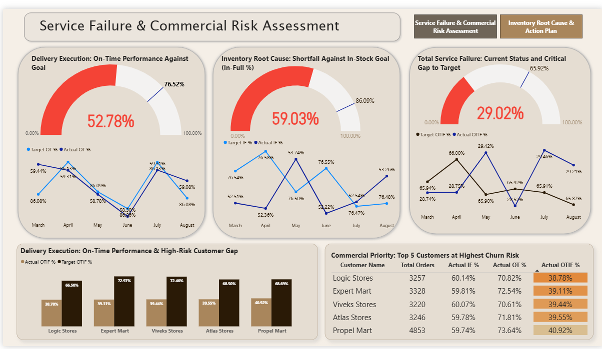

Here you go — fully cleaned, structured, and GitHub-friendly **README.md** format (all emojis, links, images, code blocks, and spacing optimized).
Just copy-paste into your README file.👇

---

```md
# 🚀 Supply Chain Service Reliability & Customer Fulfillment Overhaul

This repository documents an end-to-end analysis of a major collapse in customer service and order fulfillment metrics (**OTIF: On-Time, In-Full**).

---

## 📉 The Problem

OTIF performance dropped to **29.02%**, a **36% deviation from target**, triggering:

- High-risk customer churn
- Fulfillment instability
- Operational inefficiency

---

## 🔍 Key Finding

Through diagnostic metric separation (**LIFR vs VOFR**), the analysis revealed:

| Metric | Meaning | Status |
|--------|---------|--------|
| **VOFR % (Volume Fill Rate)** | Warehouse capacity availability | ✔ **96.59% — Capacity is sufficient** |
| **LIFR % (Line-Item Fill Rate)** | Stock availability accuracy | ❌ **65.96% — Inventory planning failure** |

✔ Result: The root cause is a **planning failure**, not a warehouse or logistics constraint.

---

## 🏆 Core Achievement

Delivered a **two-part operational recovery strategy** targeting:

- Top **5 critical SKUs**
- High-risk key accounts
- Largest logistics inefficiency bucket (**8.3K single-day delays**)

---

## 🧭 Project Index

| Section | Link |
|---------|------|
| 1️⃣ Business Problem & Objectives | [Click](#1-business-problem-and-objectives) |
| 2️⃣ Data Sources & ETL Process | [Click](#2-data-sources-and-etl-process) |
| 3️⃣ Dashboard 1: Executive Insights | [Click](#3-dashboard-1-executive-insights-risk-assessment) |
| 4️⃣ Dashboard 2: Root Cause & Action Plan | [Click](#4-dashboard-2-root-cause-and-action-plan) |
| 5️⃣ Prioritized Recommendations | [Click](#5-prioritized-recommendations) |
| 6️⃣ Repository Structure | [Click](#6-repository-structure) |
| 7️⃣ Author & Contact | [Click](#7-author-contact) |

---

## <a id="1-business-problem-and-objectives"></a>1️⃣ Business Problem & Objectives

Objective: Provide an immediate, quantified correction plan for declining service levels.

### Core Objectives

- **Diagnosis:** Identify failure point (Inventory vs Logistics)
- **Risk Quantification:** Detect high-risk accounts and regions
- **Recovery Roadmap:** Prioritize SKU-level and operational fixes

---

## <a id="2-data-sources-and-etl-process"></a>2️⃣ Data Sources & ETL Process

📁 Input files located under: `C2 Input for participants/`

### 🛠 ETL Logic Contribution

The ETL work focused on **metric decoupling** using SQL:

| Metric | Definition | Insight |
|--------|------------|---------|
| **VOFR %** | Measures whether warehouse had enough total volume capacity | High capacity (No issue) |
| **LIFR %** | Defines SKU-level availability accuracy | Low value → Stockout & planning flaws |

SQL logic available in: `supply_chain.sql`

---

## <a id="3-dashboard-1-executive-insights-risk-assessment"></a>3️⃣ Dashboard 1 — Executive Insights

📊 *Answers: Who is impacted? Where is the failure concentrated?*

### ✔ 3.1 Service Trend Failure

> The collapse began sharply in **Q2**, signaling a parameter failure rather than external volatility.

### ✔ 3.2 High-Risk Customer Exposure

- **Logic Stores**
- **Expert Mart**

Require urgent account intervention.

### ✔ 3.3 Regional Risk

- **Ahmedabad** has the steepest decline and is prioritized for operational corrections.

---

### 📷 Dashboard Preview

> *(Make sure the `images/` folder exists and filenames match)*



---

## <a id="4-dashboard-2-root-cause-and-action-plan"></a>4️⃣ Dashboard 2 — Root Cause & Action Plan

📊 *Answers: What caused the failure? How do we fix it?*

### ✔ 4.1 Diagnostic Outcome

> Failure is **100% planning-driven** — not logistics or capacity.

### ✔ 4.2 SKU-Level Concentration

A small SKU subset drives the majority of fulfillment failures.


### ✔ 4.3 Tactical Logistics Fix

The single largest operational inefficiency:  
📌 **8.3K orders delayed by exactly 1 day**

.png)

---

## <a id="5-prioritized-recommendations"></a>5️⃣ Prioritized Recommendations

### 🏗 Long-Term Structural Fix (Planning & Inventory)

| Action | Owner | Goal |
|--------|--------|------|
| Immediate Stock Review | Supply Planning | Correct Top 5 SKU forecasting parameters |
| LIFR Stabilization | Head of Supply Chain | Raise LIFR from **65.96% → ~75% in 30 days** |
| Planning Audit | Analytics Team | Audit safety stock, lead times, forecast logic |

### ⚡ Tactical Fix (Logistics & Commercial)

| Action | Owner | Goal |
|--------|--------|------|
| Customer Outreach | Sales Team | Recovery communication with top 5 high-risk customers |
| Reduce 1-Day Delays | Distribution Manager | **50% reduction** target (from 8.3K orders) |
| Geographic Prioritization | Operations | Focus on Ahmedabad for dispatch & routing optimization |

---

## <a id="6-repository-structure"></a>6️⃣ Repository Structure

```

supply-chain-fulfillment-overhaul/
├── C2 Input for participants/
│   ├── dim_customers.csv
│   └── C2 Business Knowledge.pdf
├── images/
│   ├── Dashboard_1.png
│   ├── Insight 5.2 SKU-Level Concentration...png
│   └── Insight 5.4 Logistics Tactical Fix (Quick Win).png
├── Supply Chain Service Reliability.pbix
├── Supply Chain Service Reliability.pdf
└── supply_chain.sql

```

---

## <a id="7-author-contact"></a>7️⃣ Author & Contact

💡 Open to collaboration, feedback, and discussion.

| Field | Details |
|--------|---------|
| **Name** | Gagan C Holkar |
| **Email** | gagancholkar@gmail.com |
| **LinkedIn** | https://www.linkedin.com/in/gagan-holkar |

---

### ⭐ If you found this useful, feel free to star the repository!

```

---

Would you like:

* A **GitHub banner image** for the top?
* A **badge section (Power BI | SQL | Data Analytics)**?
* A downloadable **PDF version** of this README?

🙂
